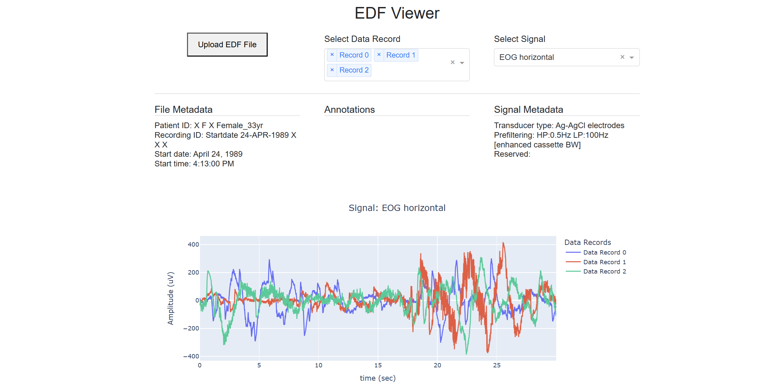

# EDF Viewer

A simple web app for visualizing EEG and other biosignal data stored in EDF (European Data Format) files. Built with [Dash](https://dash.plotly.com/) and [Plotly](https://plotly.com/python/), this viewer allows you to upload an EDF file, explore its signal and recording metadata, and view signal data interactively.

<p align="center">
  
</p>

---

## 🚀 Features

- Upload `.edf` files directly in the browser
- Select data records and signal source
- Display of file metadata and signal metadata
- Interactive plots for signal data

---

## 📦 Installation

1. Clone the repository:

I recommend creating a virtual environment before installing:

```bash
python -m venv .venv
source .venv/bin/activate  # On Windows use: .venv\Scripts\activate
```

Then install the package directly from GitHub:

```bash
pip install git+https://github.com/bhedelius/edf_viewer.git
```

### 🚀 Usage
Once installed, you can launch the app using:

```bash
python -m edf_viewer
```

The app will be available at `http://127.0.0.1:8050/`.

## 🧪 Example Dataset

**PhysioNet – Sleep-EDF Expanded Dataset**  
A collection of sleep study recordings with EEG, EOG, EMG signals, and sleep stage annotations.

- 🔗 [Sleep-EDF Expanded Dataset (PhysioNet)](https://physionet.org/content/sleep-edfx/1.0.0/)
- 🧠 Use cases: Sleep research, EEG signal processing

---

## 📄 EDF File Structure

EDF (European Data Format) files contain physiological data in a standardized binary format. The structure is as follows:

### 🧾 Header Record (ASCII)
Total size: `256 + (ns × 256)` bytes  
Where `ns` is the number of signals.

#### 📁 File Metadata (256 bytes total)
| Field                       | Size (bytes) | Description                          |
|-----------------------------|--------------|--------------------------------------|
| Version                     | 8            | EDF version (usually "0")            |
| Patient ID                  | 80           | Local patient identification         |
| Recording ID                | 80           | Local recording identification       |
| Start Date                  | 8            | Format: `dd.mm.yy`                   |
| Start Time                  | 8            | Format: `hh.mm.ss`                   |
| Reserved                    | 44           | Reserved for future use              |
| Number of Data Records      | 8            | Total number of data records         |
| Duration of a Data Record   | 8            | In seconds                           |
| Number of Signals (`ns`)    | 4            | Total number of signals              |

#### 📊 Signal Metadata (256 bytes × `ns`)
Each signal has its own 256-byte block with the following fields:

| Field                       | Size (bytes) | Description                          |
|-----------------------------|--------------|--------------------------------------|
| Label                       | 16           | Measurement label (e.g., EEG Fpz-Cz) |
| Transducer Type             | 80           | Type of sensor used                  |
| Physical Dimension          | 8            | Unit of measurement (e.g., µV)       |
| Physical Minimum            | 8            | Minimum physical value               |
| Physical Maximum            | 8            | Maximum physical value               |
| Digital Minimum             | 8            | Minimum digital value                |
| Digital Maximum             | 8            | Maximum digital value                |
| Prefiltering                | 80           | Description of filtering applied     |
| Number of Samples/Record    | 8            | Samples per record for this signal   |
| Reserved                    | 32           | Reserved for future use              |

---

### 📈 Data Records (Binary Integers)
Each data record contains actual signal samples for all channels, stored consecutively:

```
[ Signal 1 Samples ][ Signal 2 Samples ] ... [ Signal ns Samples ]
```

Each sample is a 2-byte (16-bit) little-endian signed integer.

## ⚙️ Design & Parsing with Pydantic

The EDF Viewer uses **Pydantic** for parsing and validating the EDF data, ensuring that the file is correctly structured and the metadata adheres to the expected format. The parsing design follows a clean and modular approach:

1. **Data Models with Pydantic**:  
   We define Pydantic models that correspond to the various records and sections in the EDF file. These models define the structure and types of each field, providing automatic validation when loading data.

2. **Parsing EDF Header**:  
   The header of the EDF file contains essential information about the file, including the number of signals and metadata. Pydantic models are used to extract this information from the raw binary data and validate that the values are correct.

3. **Signal and File Metadata**:  
   Metadata related to both the file and each signal is parsed into specific Pydantic models. This ensures that all fields are properly typed and validated, such as:
   - **File metadata** (e.g., patient information, recording time, number of signals)
   - **Signal metadata** (e.g., signal labels, physical units, sample rates)

4. **Custom Binary Reader**:  
   A custom binary reader is responsible for reading the raw EDF file byte-by-byte, using Pydantic models to store the parsed data. This binary reader handles both ASCII and binary sections of the EDF file efficiently.

By using Pydantic's strong typing and validation features, the EDF Viewer ensures that the data parsed from EDF files is accurate and consistent, minimizing the chance of errors when processing or displaying the data.

## 📄 License

[MIT License](LICENSE)
